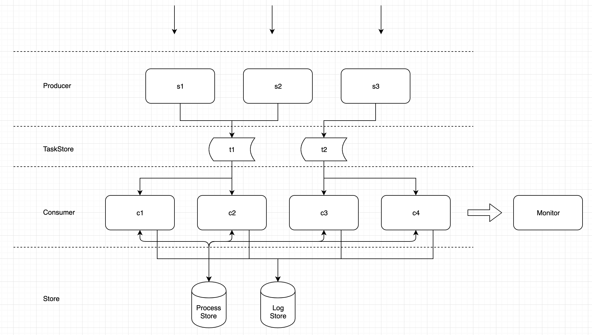

# UTask 

方便可靠的异步任务处理系统

利用`UTask`业务方将不需要实现一套`队列 + 脚本`的架构, 直接实现`http接口`, 即可完成异步任务的执行, 跟踪和监控

可以广泛应用于各种异步任务的场景, 如:

- 游戏平台支付成功后通知游戏发货
- 定时通知游戏开启或者关闭一个活动
- 电商平台中下单后15分钟未付款时关闭订单

## PPT: [UTask.pdf](docs/UTask.pdf)

## 功能概述

- 异步调用HTTP接口
- 延迟调用 
- 定时调用 
- 异常重试机制
- 日志查询和监控
- 分布式部署
- 服务接入SDK

## TODO
- `Tasker` RPC任务类型
- `Tasker` PHP函数任务类型
- `TaskStorer` Kafka实现
- `Sdk` PHP接入SDK


## 快速开始
### 安装
```bash
git clone https://github.com/meixiu/utask
```
### 修改配置
配置文件在`config`目录下, 参考注释进行基本的参数配置

- `config/local.yaml`: 本地开发环境
- `config/dev.yaml`: dev开发环境

### 运行
```bash
go run utask.go -c=config/dev.yaml
```

### 测试
- 启动测试第三方服务接口

```bash
cd example/third
go run main.go
```

- 推送一条测试任务

```bash
go run push-get.go
go run push-post.go
```

## Demo监控部署
- Prometheus 部署

prometheus.yml配置

```code
  scrape_configs:
  # The job name is added as a label `job=<job_name>` to any timeseries scraped from this config.
  - job_name: 'uTask'

    # metrics_path defaults to '/metrics'
    # scheme defaults to 'http'.
    scrape_interval: 3s

    static_configs:
    - targets: ['docker.for.mac.localhost:8020']
```

部署

```
docker run \
  -p 9090:9090 \
  -v /data/prom:/etc/prometheus \
  prom/prometheus
```

- Grafana部署

```
docker run \
  -d \
  -p 3000:3000 \
  --name=grafana \
  -e "GF_SERVER_ROOT_URL=http://grafana.server.name" \
  -e "GF_SECURITY_ADMIN_PASSWORD=secret" \
  grafana/grafana
```

## 系统架构


## 服务接入
### GO SDK接入示例

- http get请求任务: [example/push-get.go](example/push-get.go)
- http post请求任务: [example/push-post.go](example/push-post.go)
- http 任务认证: [example/third/api/api.go](example/third/api/api.go)

### PHP SDK接入示例

- TODO